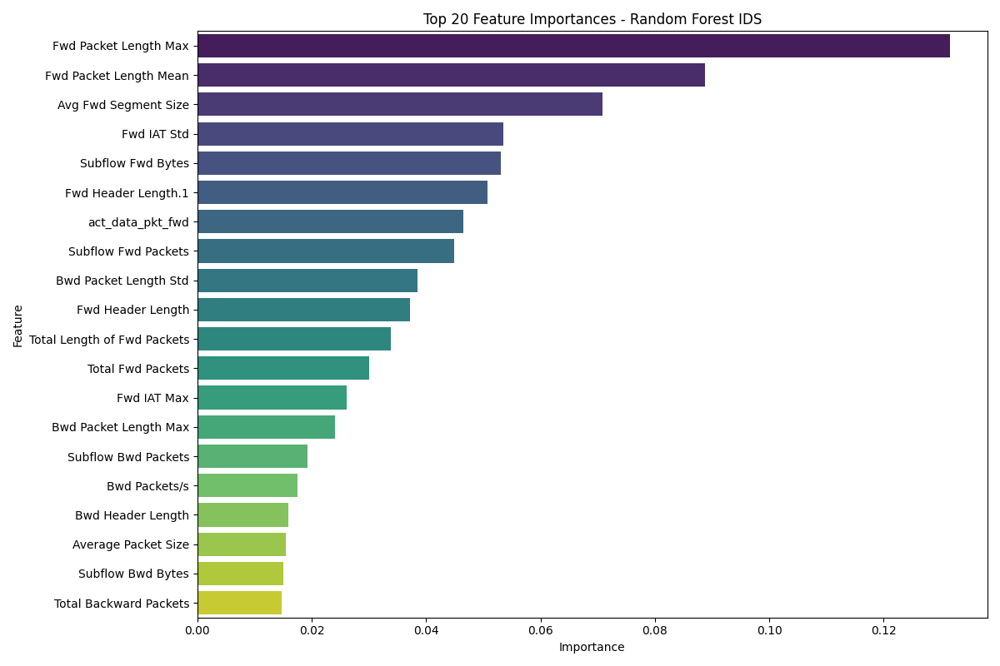
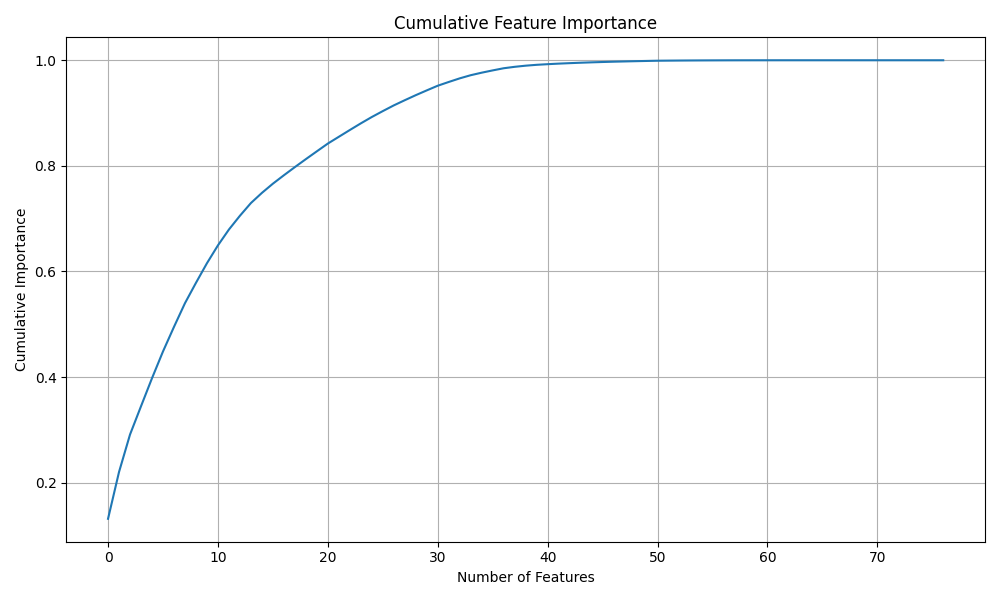

# ML-Based Network Intrusion Detection System (IDS)

This project implements an **end-to-end Machine Learning–based Network Intrusion Detection System (IDS)** using real-world network traffic data (CICIDS2017). The system detects malicious network activities by learning patterns from labeled traffic and provides interpretable insights for cybersecurity monitoring.

The pipeline covers **data preprocessing, exploratory data analysis, model training, validation, and feature importance analysis**, ensuring robust and reproducible results.

---

## 📌 Motivation

Traditional rule-based IDS solutions struggle to detect evolving and complex cyberattacks. Machine Learning (ML) can learn from historical patterns to detect both known and novel attacks.

This project aims to:
- Apply **ML techniques** to real-world cybersecurity datasets
- Build **robust models with validation to avoid overfitting**
- Generate **explainable insights** for network security
- Prepare a **research-oriented project** for academic purposes

---

## 📂 Dataset

- **CICIDS2017 dataset**: realistic network traffic with both benign and attack flows
- Features: 77 network flow attributes (duration, packet/byte statistics, etc.)
- Size: ~755,000 network flows
- Labels: Benign vs Attack (multi-class, combined into binary for IDS)

---

## ⚙️ Project Pipeline 

### **Data Loading & Cleaning**
- Loaded multiple raw CSV files and combined them
- Standardized column names and removed redundant or sensitive features (`IP`, `Port`, `Timestamp`)
- Handled missing and infinite values
- Saved processed dataset: `data/processed/X_processed.csv` and `y_labels.csv`

### **Exploratory Data Analysis (EDA)**
- Analyzed class distribution: benign vs attack traffic
- Visualized key feature distributions
- Checked correlations and initial patterns

### **Preprocessing**
- Encoded categorical labels using `LabelEncoder`
- Scaled numerical features using `StandardScaler`
- Saved processed datasets for reproducibility

### **Model Training with Validation**
- **Train / Validation / Test Split** to prevent overfitting
  - Train: 64%
  - Validation: 16%
  - Test: 20%
- Trained two models:
  1. Logistic Regression (baseline)
  2. Random Forest (strong ensemble)
- Validation and test evaluation metrics saved in `reports/day5_results.json`
- **Results:**

| Model               | Validation Accuracy | Test Accuracy |
|--------------------|------------------|---------------|
| Logistic Regression | 98.56%           | 98.61%       |
| Random Forest       | 99.99%           | 99.99%       |

- Random Forest confusion matrix (Test Set):

[[125428 6]
[ 7 25598]]

### **Feature Importance & Explainability**
- Computed **Random Forest feature importances**
- Visualized top 20 features and cumulative importance
- Validated feature importances using **validation set**
- Saved results:
  - `reports/feature_importances.csv`
  - `reports/top20_feature_importances.png`
  - `reports/cumulative_feature_importance.png`
  - `reports/feature_importance_validation.json`

**Key Insights:**
- Top predictive features include **flow duration, packet counts, byte statistics**  
- Model generalizes well: validation accuracy ≈ test accuracy  
- Provides interpretable insights for network security monitoring

---

## 🗂️ Project Structure

ml-network-intrusion-detection/
│
├── data/
│ ├── raw/ # Original CICIDS2017 CSV files
│ └── processed/ # Cleaned and scaled datasets
│
├── src/
│ ├── preprocessing.py
│ ├── train_models.py
│ └── feature_importance.py
│
├── models/ # Trained ML models
├── reports/ # Metrics, plots, feature importance
└── README.md

---

## 📊 Visualizations

- **Top 20 Feature Importances**

- **Cumulative Feature Importance**

---

## 🎯 Learning Outcomes

- Hands-on experience with **large-scale network traffic data**
- Implemented **robust ML pipeline** with train/validation/test split
- Trained and evaluated **baseline and ensemble models**
- Extracted **explainable insights** using feature importance
- Developed **reproducible research-oriented code**

---

